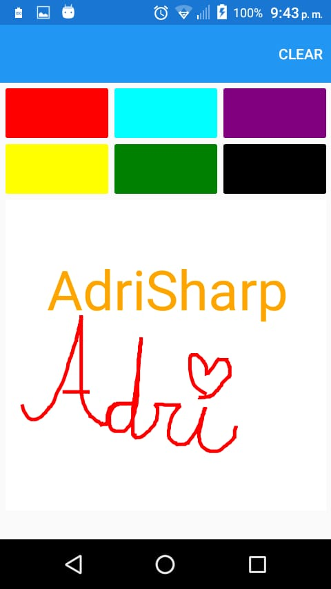

# CanvasTarea5MAD
SkiaSharp Basic Implementation - Basic Drawing App
**References:**\
\

####**Packages used:**\
- SkiaSharp
- SkiaSharp.Views

#### Initial Screenshots\
\
\

###Coming features:\
- Bitmap implementation
- MVVM
- Export feature
- Import feature
- Individual color variation
- User controlled brushes's thickness
